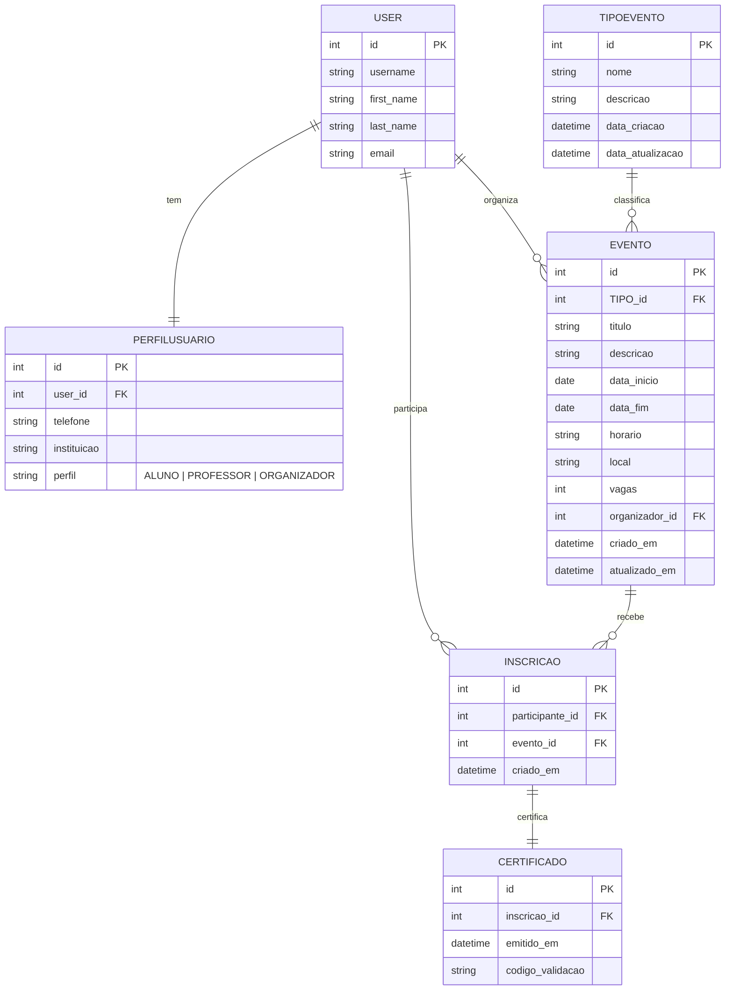

# SGEA — Sistema de Gestão de Eventos Acadêmicos

Projeto desenvolvido para a disciplina de Programação Web com Django, com o objetivo de criar um sistema simples para gerenciamento de eventos acadêmicos, permitindo o cadastro de usuários, criação de eventos e emissão de certificados de participação.

## 🖥️ Tecnologias utilizadas
- Python 3.12
- Django 5
- HTML e CSS
- Banco de dados SQLite3

## ⚙️ Como executar o projeto

1. **Crie o ambiente virtual:**
   ```bash
   python -m venv .venv
   
2. **Ative o ambiente virtual:**

   * Windows:

     ```bash
     .venv\Scripts\activate
     ```
   * Linux/Mac:

     ```bash
     source .venv/bin/activate
     ```
3. **Instale as dependências:**

   ```bash
   pip install -r requirements.txt
   ```
4. **Execute as migrações do banco:**

   ```bash
   python manage.py migrate
   ```
5. **Crie um superusuário (opcional):**

   ```bash
   python manage.py createsuperuser
   ```
6. **Inicie o servidor:**

   ```bash
   python manage.py runserver
   ```

Acesse o sistema em:
👉 [http://127.0.0.1:8000/](http://127.0.0.1:8000/)

---

## 📋 Funcionalidades implementadas

* **Cadastro e login de usuários**
* Criação automática do **perfil de usuário** (aluno, professor ou organizador)
* **Organizador:** pode cadastrar, editar e excluir eventos
* **Aluno/Professor:** pode se inscrever em eventos disponíveis
* **Certificados:** geração de código único de validação

---


### Legenda do Diagrama (Entidades e Cardinalidades)
- **TipoEvento 1..N Evento** — um tipo classifica vários eventos.
- **User 1..1 PerfilUsuario** — cada usuário tem exatamente um perfil.
- **User 1..N Evento** — um usuário (organizador/professor) organiza vários eventos.
- **Evento 1..N Inscricao** — um evento pode ter várias inscrições.
- **User 1..N Inscricao** — um usuário pode se inscrever em vários eventos.
- **Inscricao 1..1 Certificado** — cada inscrição possui no máximo um certificado.

### Atributos-chave (resumo)
- **TipoEvento**: `id (PK)`, `nome`, `descricao`, `data_criacao`, `data_atualizacao`  
- **PerfilUsuario**: `id (PK)`, `user_id (FK→User.id)`, `telefone`, `instituicao`, `perfil`  
- **Evento**: `id (PK)`, `TIPO_id (FK→TipoEvento.id)`, `titulo`, `descricao`, `data_inicio`, `data_fim`, `horario`, `local`, `vagas`, `organizador_id (FK→User.id)`, `criado_em`, `atualizado_em`  
- **Inscricao**: `id (PK)`, `participante_id (FK→User.id)`, `evento_id (FK→Evento.id)`, `criado_em`  
  - **Restrição**: `UNIQUE (participante_id, evento_id)`  
- **Certificado**: `id (PK)`, `inscricao_id (FK UNIQUE→Inscricao.id)`, `emitido_em`, `codigo_validacao (UNIQUE)`

## 👩‍💻 Desenvolvido por

**Cássia Gabriela Gonçalves da Paixão**
RA: **22252157**
Curso: **Ciência da Computação — 7º semestre (UniCEUB)**

Brasília, outubro de 2025.
