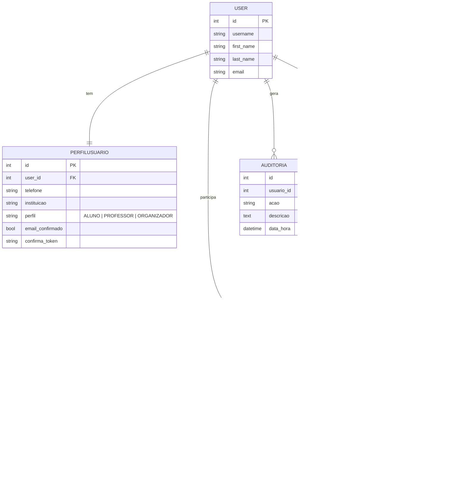

# SGEA — Sistema de Gestão de Eventos Acadêmicos

Projeto acadêmico em **Django 5** com **Django REST Framework**, cobrindo:
- Cadastro/Autenticação com **confirmação por e-mail** (Item 7)
- **Validação avançada de formulários** (telefone com máscara, datepicker/timepicker, e validações robustas) (Item 1)
- **Seeding** de usuários (organizador, aluno, professor) (Item 2)
- **API REST** (token, listagem de eventos e inscrição, com **throttling** diário) (Item 3)
- **Banner do evento** (upload + validação + exibição) (Item 4)
- **Regras de negócio** (datas, vagas, professor responsável, senha forte, inscrição única) (Item 6)
- **Certificados automáticos** após término do evento (Item 8)
- **Perfis e permissões** (Organizador / Aluno / Professor) (Item 9)
- **Registros de auditoria (logs)** com tela de consulta por dia/usuário (Item 10)
- **Identidade visual simples** (CSS + logo no e-mail) (Item 11)

---

## 🧰 Tecnologias

- Python 3.11+ / 3.12
- Django 5.x
- Django REST Framework
- SQLite3
- Pillow (imagens)
- ReportLab (PDF)
- jQuery UI + timepicker addon (datepicker/timepicker)

---

## ⚙️ Setup rápido

> Em Windows:
```bash
python -m venv .venv
.\.venv\Scripts\activate
pip install -r requirements.txt  # ou: pip install django djangorestframework Pillow reportlab
python manage.py migrate
python manage.py collectstatic --noinput
```

### Seeding (Item 2)
Cria os 3 usuários de teste:
```bash
python manage.py seed_sgea
```
- **Organizador**: `organizador@sgea.com` / `Admin@123`  
- **Aluno**: `aluno@sgea.com` / `Aluno@123`  
- **Professor**: `professor@sgea.com` / `Professor@123`

### Executar
```bash
python manage.py runserver
```
Acesse: http://127.0.0.1:8000/

---

## 📦 Estrutura/Config

- `sgeaweb/models.py`
  - `PerfilUsuario` com `email_confirmado` e `confirma_token` (Item 7)
  - `Evento.banner` (ImageField) (Item 4)
  - `Inscricao.presenca_confirmada` (para emissão automática) (Item 8)
  - `Auditoria` (Item 10)

- `sgeaweb/forms.py` (Item 1 & 6)
  - **UserRegisterForm**: e-mail único + senha forte (mín. 8, letra, número, especial) e **confirmação**.
  - **PerfilUsuarioForm**: telefone com validação `(XX) XXXXX-XXXX`.
  - **EventoForm**: bloqueia data no passado, `data_fim` ≥ `data_inicio`, valida **banner** (tipo, tamanho ≤ 3MB, dimensões mín. 400×300).

- `sgeaweb/static/sgeaweb/js/forms.js` (Item 1)
  - Máscara de telefone (input)
  - jQuery UI **datepicker** (`.datepicker`)
  - timepicker addon (`.timepicker`)

- `ProjetoSGEA/urls.py`
  - Inclui rotas do app e **rotas da API**: `path("api/", include("sgeaweb.api.urls"))` (Item 3)

- `settings.py`
  - DRF com **TokenAuthentication** e **throttling**:
    - `eventos_list` → **20/day**
    - `inscricoes_create` → **50/day**
  - `EMAIL_BACKEND` em **console** (mostra HTML no terminal).  
  - **Static/Media** já configurados; use `collectstatic`.

- **Logo**
  - Coloque um PNG em: `sgeaweb/static/sgeaweb/img/logo.png`
  - Usado no e-mail de confirmação (Item 7)

---

## 🔐 Perfis & Permissões (Item 9)

- **Organizador**
  - CRUD de eventos
  - Vincula **Professor responsável** (obrigatório)
  - Consulta **Auditoria**
  - **Não** pode se inscrever em eventos
- **Aluno/Professor**
  - Podem se inscrever
  - Visualizam/baixam certificados

---

## ✅ Regras de Negócio (Item 6)

- `Evento.data_inicio` **não** pode ser no passado.
- `Evento.data_fim` ≥ `data_inicio`.
- Evento **deve** ter `responsavel` (Professor).
- Inscrição: **sem duplicidade** por usuário/evento.
- Respeita **limite de vagas**.
- Senha forte e **confirmação** no cadastro.

---

## ✉️ Fluxo de E-mail (Item 7)

- Ao cadastrar, geramos `confirma_token` e enviamos e-mail (template `templates/email/confirmacao.html` com logo).
- Link: `/confirmar/<token>/`
- **Bloqueia login** até confirmar o e-mail.

> Dev: com `EMAIL_BACKEND = console`, o HTML sai no terminal. Em produção, troque para SMTP.

---

## 🖼️ Banner (Item 4)

- Campo `Evento.banner` (ImageField)
- Valida **tipo** (image/*), **tamanho** (≤ 3MB), **mínimo 400×300**
- Exibição na página de **detalhe do evento**

---

## 🧾 Auditoria (Item 10)

- Registramos:
  - criação de usuário, **login/logout**, confirmação de e-mail
  - **CRUD** de eventos
  - **Consultas/inscrições via API**
  - emissão/consulta/download de **certificados**
  - **inscrições**
- Tela: `/auditoria/` (apenas Organizadores)
  - Filtro por **data (YYYY-MM-DD)** e por **usuário**

---

## 🪪 Certificados (Item 8)

- **Automáticos**: em *Minhas Inscrições*, se `evento.data_fim <= hoje` **e** `presenca_confirmada`, gera o certificado (código único).
- **Manuais** (Organizador): página de inscritos do evento.
- **PDF**: botão “Baixar PDF” (ReportLab).

---

## 🔗 API REST (Item 3)

### Autenticação (Token)
- Endpoint (com Browsable API):  
  `POST /api/auth/token/`
- Body (form ou JSON):
```json
{
  "username": "aluno@sgea.com",
  "password": "Aluno@123"
}
```
- Resposta:
```json
{ "token": "SEU_TOKEN" }
```

Use nas demais chamadas:
```
Authorization: Token SEU_TOKEN
```

### 3.1. Consulta de Eventos (20/day)
`GET /api/eventos/`
```bash
curl -H "Authorization: Token SEU_TOKEN" http://127.0.0.1:8000/api/eventos/
```
Resposta (exemplo):
```json
[
  {
    "id": 1,
    "tipo_id": 2,
    "tipo_nome": "Palestra",
    "titulo": "Introdução a Redes",
    "descricao": "...",
    "data_inicio": "2025-12-10",
    "data_fim": "2025-12-10",
    "horario": "18:30:00",
    "local": "Auditório 1",
    "vagas": 50,
    "organizador": "organizador@sgea.com"
  }
]
```

### 3.2. Inscrição de Participantes (50/day)
`POST /api/inscricoes/`
```bash
curl -X POST -H "Authorization: Token SEU_TOKEN" \
     -H "Content-Type: application/json" \
     -d '{"evento_id": 1}' \
     http://127.0.0.1:8000/api/inscricoes/
```

---

## 🧪 Roteiro de Testes (resumo)

1. **Cadastro** → validações (e-mail único, senha forte, telefone) → ver **e-mail no console**, abrir `/confirmar/<token>/`.
2. **Login**: bloqueia antes de confirmar; depois permite.
3. **Organizador** cria evento (banner válido, datas, professor responsável).  
4. **Aluno/Professor** se inscreve (sem duplicar, respeita vagas).
5. Ajuste `data_fim` para hoje/passado → **certificado automático** em *Minhas Inscrições* → **PDF**.
6. **API**: token → `GET /api/eventos/` (20/dia) → `POST /api/inscricoes/` (50/dia).  
7. **Auditoria**: acessar `/auditoria/`, filtrar por dia/usuário e conferir registros.

---

## 🧭 Diagrama ER (atualizado)


```mermaid
erDiagram
    USER {
      int id PK
      string username
      string first_name
      string last_name
      string email
    }

    PERFILUSUARIO {
      int id PK
      int user_id FK
      string telefone
      string instituicao
      string perfil  "ALUNO | PROFESSOR | ORGANIZADOR"
      bool  email_confirmado
      string confirma_token
    }

    TIPOEVENTO {
      int id PK
      string nome
      string descricao
      datetime data_criacao
      datetime data_atualizacao
    }

    EVENTO {
      int id PK
      int TIPO_id FK
      string titulo
      string descricao
      date data_inicio
      date data_fim
      string horario
      string local
      int vagas
      int organizador_id FK
      string banner  "ImageField"
      datetime criado_em
      datetime atualizado_em
    }

    INSCRICAO {
      int id PK
      int participante_id FK
      int evento_id FK
      bool presenca_confirmada
      datetime criado_em
      %% UNIQUE(participante_id, evento_id)
    }

    CERTIFICADO {
      int id PK
      int inscricao_id FK
      datetime emitido_em
      string codigo_validacao
      %% UNIQUE(inscricao_id), UNIQUE(codigo_validacao)
    }

    AUDITORIA {
      int id PK
      int usuario_id FK
      string acao
      text descricao
      datetime data_hora
    }

    TIPOEVENTO ||--o{ EVENTO : classifica
    USER ||--|| PERFILUSUARIO : "tem"
    USER ||--o{ EVENTO : "organiza"
    EVENTO ||--o{ INSCRICAO : "recebe"
    USER ||--o{ INSCRICAO : "participa"
    INSCRICAO ||--|| CERTIFICADO : "certifica"
    USER ||--o{ AUDITORIA : "gera"
```

---

## 📁 Requisitos/Dependências

Crie/atualize `requirements.txt` (se ainda não existir):
```
Django>=5.0,<6.0
djangorestframework>=3.15
Pillow>=10.0
reportlab>=4.0
```

---

## 👩‍💻 Autoria

**Cássia Gabriela Gonçalves da Paixão**  
RA: **22252157**  
Curso: **Ciência da Computação — 7º semestre**  
Brasília, 2025.
